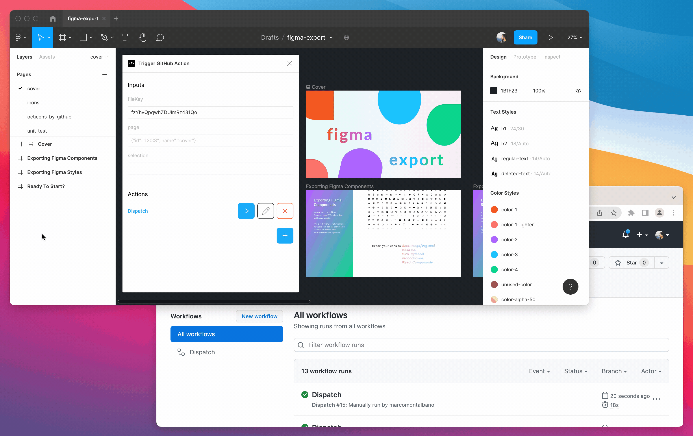

# Figma Plugin - Trigger GitHub Actions

Trigger [GitHub Actions](https://github.com/features/actions) from [Figma](https://www.figma.com/) sending the selected page and all selected nodes as [inputs](https://docs.github.com/en/actions/using-workflows/workflow-syntax-for-github-actions#onworkflow_dispatchinputs).

## Figma • Usage

First of all you need to install this extension from 

-----
This action send some inputs.. you need a GH Action configured in this way..
