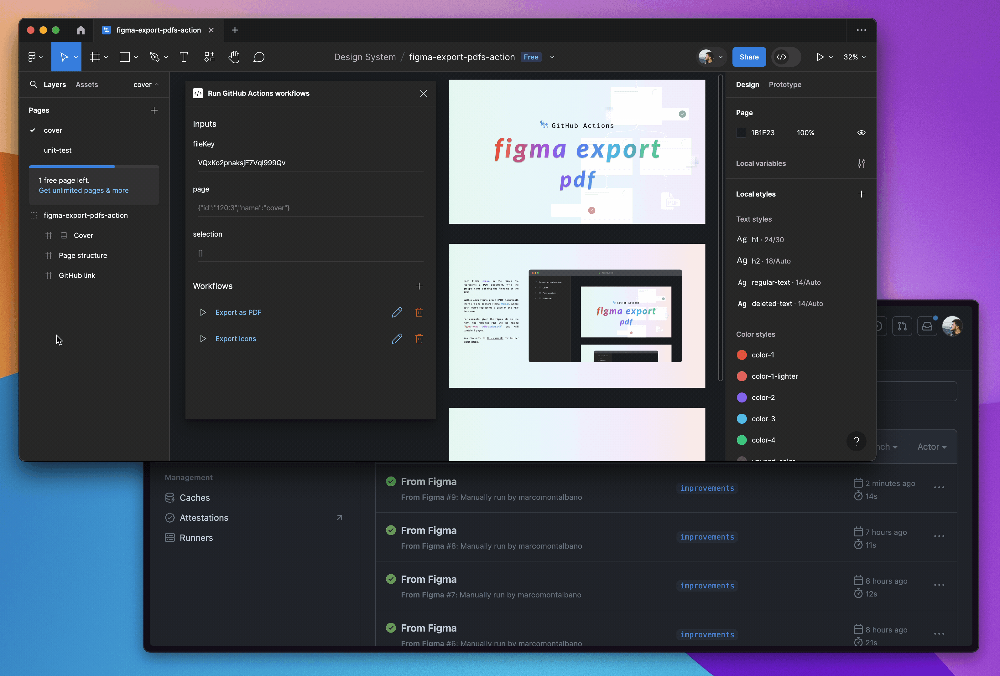

# Figma Plugin - Run GitHub Actions workflows

Run [GitHub Actions](https://github.com/features/actions) workflows directly within [Figma](https://www.figma.com/), using the selected page and nodes as [inputs](https://docs.github.com/en/actions/using-workflows/workflow-syntax-for-github-actions#onworkflow_dispatchinputs).




## Usage

Begin by creating a [GitHub Actions workflow](https://docs.github.com/en/actions/using-workflows/about-workflows).

Configure your workflow to run on [`workflow_dispatch`](https://docs.github.com/en/actions/using-workflows/events-that-trigger-workflows#workflow_dispatch) event:

```yaml
on: 
  workflow_dispatch:
    inputs:
      fileKey:
        description: Figma file key
        type: string
        required: true
      page:
        description: Stringified selected page (id, name)
        type: string
        default: '{}'
        required: true
      selection:
        description: Stringified array of the selected nodes (id, name)
        type: string
        default: '[]'
        required: true
```

As previously mentioned, the plugin triggers the workflow sending the `fileKey`, the selected `page`, and the list of selected nodes as `selection`.

You can then configure the workflow according to your needs. To get started, you can use this example [`from-figma.yaml`](.github/workflows/from-figma.yaml).

>[!TIP]
> You can manipulate the received inputs as needed. Refer to [this working example](.github/actions/run-github-actions-workflows-transformer).

### Figma

Setting up in Figma is simple. Just run [this plugin](https://www.figma.com/community/plugin/1096890502176164513/run-github-actions-workflows).

Enter the `fileKey`:


and setup a new workflow by clicking the `+` button (you'll also need a GitHub [access token](https://github.com/settings/tokens)):


Finally, select a `page` and one or more `nodes`, and then click `▶`. This will run the selected workflow, passing your selection as workflow inputs.


## Figma Export PDFs

What do you think about *exporting Figma content as PDF document to an FTP Server, just by clicking a button within Figma*? Would it be cool, isn't it?

Check out this [workflow](https://github.com/marcomontalbano/figma-export-pdfs-action/blob/main/.github/workflows/from-figma.yaml) and discover how it's entirely feasible. Simply clone the workflow and setup this Figma plugin :wink:.
